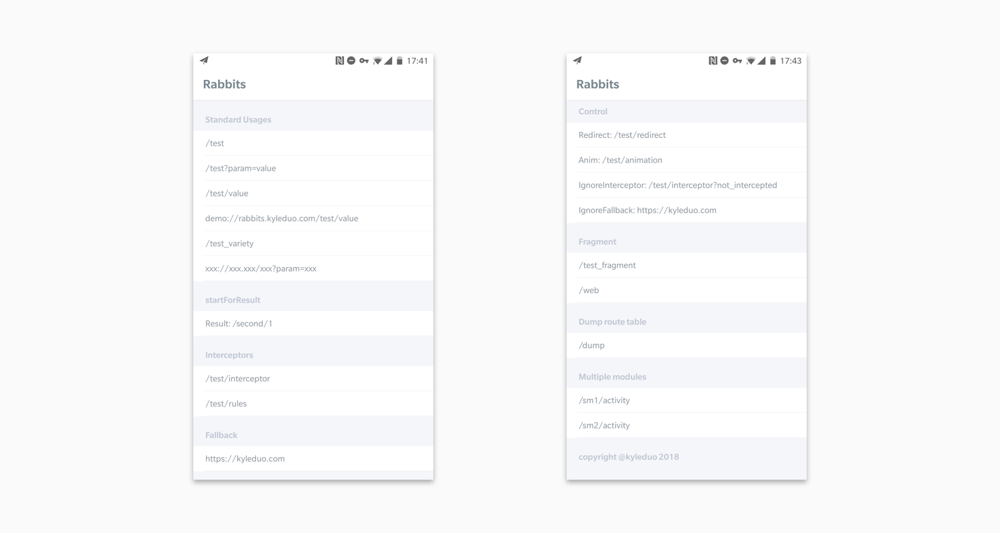

# Rabbits

[EN](./README.md)    [Blog](https://blog.kyleduo.com/2018/03/22/rabbits-100/)


**注意：** Rabbits在1.0.0版本上有非常大的改变，如果你正在使用，请在更新之前阅读wiki。


### Demo

[下载链接](./demo/demo.apk)




### Quick Glance

```java
@Page(value="/test", alias="TEST_ACT", variety=["/test_variety", "/test/{param}"])
public class TestActivity extends AppCompatActivity {}

// somewhere else
public class MainActivity extends AppCompatActivity {
  public void onButtonClicked() {
    // every statement works same
    Rabbit.from(this).to(P.TEST_ACT).putExtra("param", "value").start();
    Rabbit.from(this).to("/test?param=value").start();
    Rabbit.from(this).to(P.P_TEST_PARAM("value")).start();
  }
}
```


### 1.0.0版本的变化

我在去年开源了Rabbits并且一直使用到现在。期间运行良好并且符合项目的需求，“From-To-Start”模式让我几乎已经忘掉了`new Intent()`这种写法。Rabbits简化了页面之间的导航，不管是Activity之间还是Fragment之间。由于使用URI作为跳转协议，网页和原生页面之间的跳转页变得更加简单。

虽然使用上很简单并且符合直觉，我还是发现了一些需要改变的地方。下面是三个主要的切入点：

1. `mappings.json`。最开始设计Rabbits 的时候，我把客户端和服务端分开考量。但实际上由后端对App的行为进行控制更灵活也更合理。
2. `Interceptor`。如果你希望控制导航的流程，比如添加参数或者重定向到另一个页面，Interceptor就变得非常有用。在拦截器里面判断这个请求是否需要被拦截很傻。Url是否要被拦截的条件应该和拦截器绑定到一起，这样的话只有需要被拦截的请求才会执行到拦截器的处理方法。这才是合理的。
3. `obtain`。使用原有的`obtain`API获取目标Fragment或者Intent的调用过程并不连贯。

因此，我重新思考了Rabbits的设计，并且也参考了其他路由库来寻找有哪些其他特性也是一个路由库的必备特性。然而，我觉得让Rabbits继续保持简单小巧，并且让它的使用变得更加简单。Rabbits 1.0.0只专注一件事：页面间的导航。

因为我自底向上的重新设计了Rabbits，几乎所有的API都发生了改变。让我来列举一些比较明显且重要的改变，其他的请到wiki中查看。

1. `mappings.json`被移除。你现在需要在每个页面的类上设置页面的注解。`@Page`已经改变了，现在你可以这样使用：`@Page("/page/path")`.
2. 初始化API发生了很大的变化，但是新的API更加简单，一个链式调用就可以完成初始化。
3. `P`文件得以保留。因为`mappings.json`被移除所以Rabbits使用url生成P文件的字段。你也可以在`@Page`注解中提供`alias`属性来对页面进行友好的命名。从url生成的P文件的字段大概长这个样子：**P_PAGE_PATH**，有一个前缀`P_`。：）
4. 重新设计了路由的执行链，建议在初始化阶段设置拦截器。
5. 多Module中的使用更加简单，同时多个Module之间的耦合更少了。

### 在Gradle中使用

```groovy
dependencies {
    implementation "com.kyleduo.rabbits:rabbits:1.0.0"
    annotationProcessor "com.kyleduo.rabbits:compiler:1.0.0"
}
```

### From-To-Start 模式

因为路由就是从一个页面到另一个页面，所以From-To-Start模式非常符合直觉并且易用。

```java
// MainActivity.java
Rabbit.from(this).to(P.P_TEST).start();
```

### ProGuard 防混淆规则

因为Rabbits在编译阶段生成路由表并且在导航执行阶段没有类名加载，你只需要对路由表类进行防混淆，在ProGuard规则文件中添加如下内容：

```
-keep class com.kyleduo.rabbits.Router { *; }
```

### 迁移

如果你在使用1.0.0之前的版本，升级前请阅读wiki。

### 感谢

[OKHttp](https://github.com/square/okhttp): 我从OKHttp中学习了拦截器链条的实现。

[ARouter](https://github.com/alibaba/ARouter): `flags`的想法来自于ARouter。

## License

```
Licensed under the Apache License, Version 2.0 (the "License");
you may not use this file except in compliance with the License.
You may obtain a copy of the License at

   http://www.apache.org/licenses/LICENSE-2.0

Unless required by applicable law or agreed to in writing, software
distributed under the License is distributed on an "AS IS" BASIS,
WITHOUT WARRANTIES OR CONDITIONS OF ANY KIND, either express or implied.
See the License for the specific language governing permissions and
limitations under the License.
```

